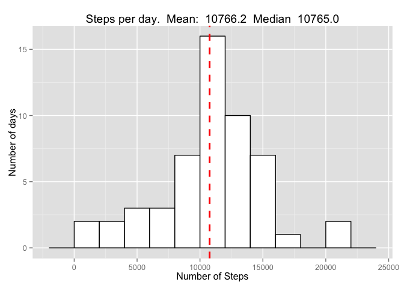
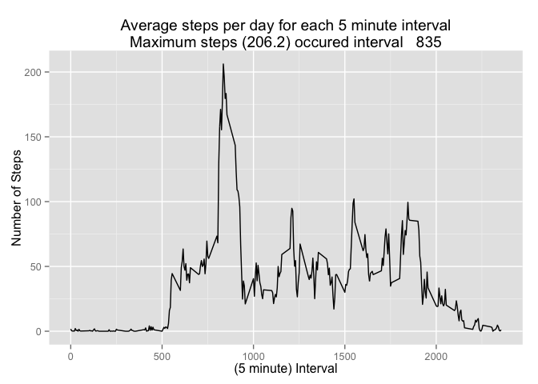
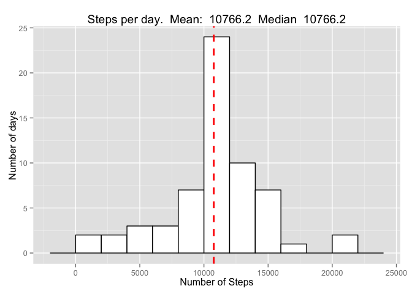

# Reproducible Research: Peer Assessment 1

*Running this report at Wed Feb 04 22:40:47 2015*


## Loading and preprocessing the data

```r
stepdata=read.csv("data/activity.csv")
summary(stepdata)
```

```
##      steps                date          interval     
##  Min.   :  0.00   2012-10-01:  288   Min.   :   0.0  
##  1st Qu.:  0.00   2012-10-02:  288   1st Qu.: 588.8  
##  Median :  0.00   2012-10-03:  288   Median :1177.5  
##  Mean   : 37.38   2012-10-04:  288   Mean   :1177.5  
##  3rd Qu.: 12.00   2012-10-05:  288   3rd Qu.:1766.2  
##  Max.   :806.00   2012-10-06:  288   Max.   :2355.0  
##  NA's   :2304     (Other)   :15840
```

```r
# Create a dataframe cmplt with no missing values
cmplt<-stepdata[!is.na(stepdata$steps),]
```
## Find the mean and median of the total number of steps per day
Since this will be done 2 times - once ignoring missing vlaues and
once with imputed missing values - the code to summarise the data
will be put in a reuseable function.

```r
stepsPerDay<-function(df) {
   steps=aggregate(df$steps, by=list(df$date), FUN=sum)
   
   step.mean=mean(steps$x)
   step.median=median(steps$x)
   tmp=sprintf("Steps per day.  Mean: %8.1f  Median %8.1f",
               step.mean, step.median)

   library(ggplot2)
   plt=ggplot(steps, aes(x=x)) + 
      geom_histogram(,color="black", fill="white", binwidth=2000) +
      labs(title=tmp, y="Number of days", 
           x="Number of Steps") +
      geom_vline(aes(xintercept=step.mean), color="red", 
                 linetype="dashed", size=1)
   plt
}
```
Create a histogram to report on the Steps per day when missing values
are not included.  Also report the Mean and Median steps per day.

```r
stepsPerDay(cmplt)
```

 
  

## What is the average daily activity pattern?


```r
avg5=aggregate(cmplt$steps, by=list(cmplt$interval), FUN=mean)
most4=avg5[avg5$x==max(avg5$x),]
tmp<-sprintf("%s\nMaximum steps (%4.1f) occured interval %5i", 
      "Average steps per day for each 5 minute interval",
      most4$x, most4$Group.1)

ggplot(avg5, aes(x=Group.1, y=x)) + geom_line() + 
   labs(title=tmp, x="(5 minute) Interval", y="Number of Steps")
```

 

## Imputing missing values
Make a dataframe like the original data but replace missing values
for steps with imputed values.  The imputed values are the average
number of steps for each time interval.

```r
nmiss=sum(is.na(stepdata$steps))
# create df impute like stepdata plus column "x" mean # steps @ interval
impute<-merge(stepdata, avg5, by.y="Group.1", by.x="interval")
# replace each missing steps with average sterps for that interval
impute$steps[is.na(impute$steps)]<-impute$x[is.na(impute$steps)]
summary(impute)
```

```
##     interval          steps                date             x          
##  Min.   :   0.0   Min.   :  0.00   2012-10-01:  288   Min.   :  0.000  
##  1st Qu.: 588.8   1st Qu.:  0.00   2012-10-02:  288   1st Qu.:  2.486  
##  Median :1177.5   Median :  0.00   2012-10-03:  288   Median : 34.113  
##  Mean   :1177.5   Mean   : 37.38   2012-10-04:  288   Mean   : 37.383  
##  3rd Qu.:1766.2   3rd Qu.: 27.00   2012-10-05:  288   3rd Qu.: 52.835  
##  Max.   :2355.0   Max.   :806.00   2012-10-06:  288   Max.   :206.170  
##                                    (Other)   :15840
```
   
There were 2304 missing values in the steps that have now been
replaced with the average values for that time period.  Re-run the 
caluculations of mean, median and the regnersate the histogram as was
done in the first step in this document.
  

```r
stepsPerDay(impute)
```

 
  
The effect of the impute is almost imperceptable, the median now equlas
the mean, but they were nearly equal to start with.

  

## Are there differences in activity patterns between weekdays and weekends?
